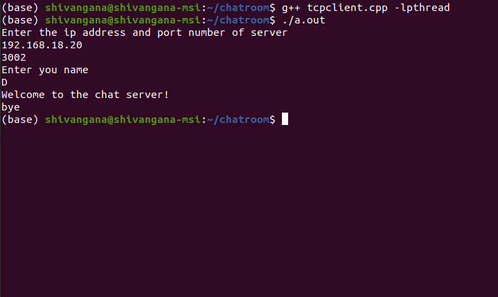

# Multiparty-TCP-Chat-Application

Multiparty TCP Chat Application in C++ using Socket Programming.

## Screenshot


## How it Works
1) Activate the server. On activation the server asks us to enter the number of clients that would be involved in the chat. </br>
2) The server then asks us to enter the ip address and the port number. </br>
3) We now activate one of the clients. We are asked to input the ip address and port number. </br>
4) After entering the ip address and port number, we are asked to enter our name. </br>
5) We get a welcome message from the server. The server also adds A to our list of active clients. </br>
6) If another client say B joins the chat then the server broadcasts the message that “B has joined the chat” to all the active clients. </br>
7) A client can leave the chat by typing "bye". The client will be removed from the list of active clients by the server. </br>

## How to Run
### Running the server
```
g++ tcpserver.cpp
```

### Running the client
```
g++ tcpclient.cpp -lpthread
```
